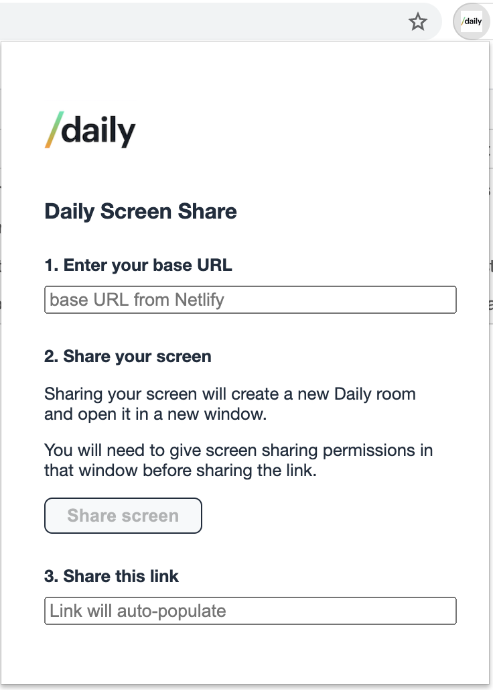

# Daily Chrome Extension: Screen Share from the Browser

There are two main parts to this Chrome extension:

- this repo, which contains the Chrome extension code for sharing your screen with just one (okay, *two*) clicks!
- the backend repo, which handles the endpoint for creating new rooms to screen share from 

## Getting Started

To use this Chrome extension locally (or until it's published in the Chrome):

- Clone this repo 
- From Chrome, open `chrome://extensions` and be sure to turn on [developer mode](https://developer.chrome.com/extensions/faq#faq-dev-01)
- Click the button `Load unpacked`
- Open this repo's directory

That's it! You'll now have this Chrome extension available for use in Chrome.

Btw: The nice thing about running using the local copy of this repo is you can make minor modifications and click `Update` from `chrome://extensions` to immediately see those changes in the browser.

## Once you have the Chrome extension installed
You will need a base URL

