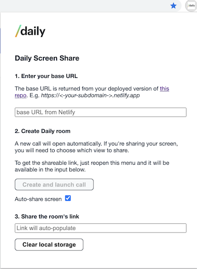

# Daily Chrome Extension: Screen Share from the Browser

There are two main parts to this Chrome extension:

- [the back-end component](https://github.com/daily-demos/prebuilt-and-serverless), which creates the endpoint for creating new Daily rooms
- this repo, which contains the Chrome extension code for sharing your screen with just one (okay, *two*) clicks!

## Before getting started...
The first step will be deploying the back-end. Follow the steps in [this repo](https://github.com/daily-demos/prebuilt-and-serverless) as a very first step. (It's quick, we promise!) You will need to have a [Daily account](https://dashboard.daily.co/) to get your Daily API key.

## Getting started

To use this Chrome extension locally (or until it's published):

- Clone this repo 
- From Chrome, open `chrome://extensions` and be sure to turn on [developer mode](https://developer.chrome.com/extensions/faq#faq-dev-01)
- Click the button `Load unpacked`
- Open this repo's directory

That's it! You'll now have this Chrome extension available for use in Chrome. The menu will look like this:

Btw: The nice thing about using the local copy of this extension is you can make minor modifications and click `Update` from `chrome://extensions` to immediately see those changes in the browser.

### Steps to sharing your screen
- Open the extension's menu in the browser.
- Insert the base URL you received from the back-end.
- Click `Share Screen`.
- A new tab will open with screen sharing enabled. Choose which view you want to share and it will officially be live.
- open the Chrome extension's menu again to get the shareable link and share away!

